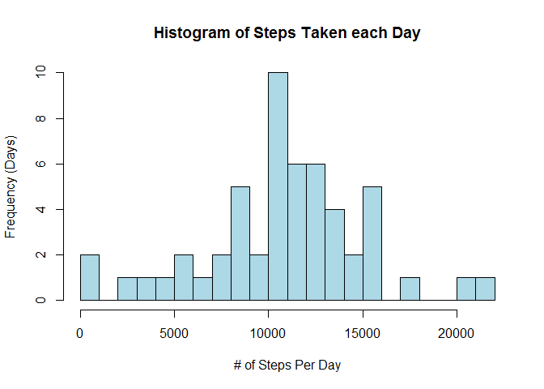
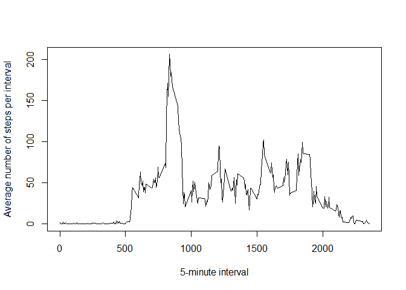
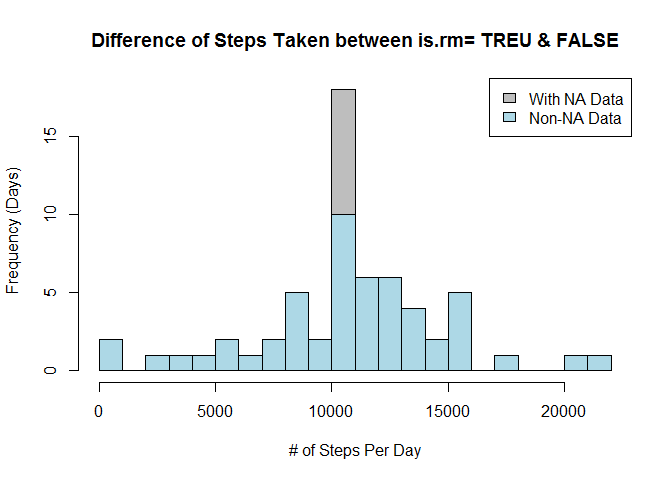
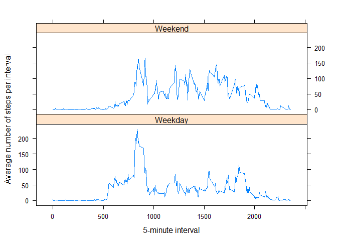

# For Data Sience Program:05 Reproducible Research Course Project 1:


  
## Loading and preprocessing the data
Show any code that is needed to

1. Load the data (i.e. read.csv())

```r
ActivityDataFile <- "./activity.csv"
activity <- read.csv(ActivityDataFile)
```

2. Process/transform the data (if necessary) into a format suitable for your analysis

```r
str(activity)
```

```
## 'data.frame':	17568 obs. of  3 variables:
##  $ steps   : int  NA NA NA NA NA NA NA NA NA NA ...
##  $ date    : Factor w/ 61 levels "2012-10-01","2012-10-02",..: 1 1 1 1 1 1 1 1 1 1 ...
##  $ interval: int  0 5 10 15 20 25 30 35 40 45 ...
```

```r
summary(activity)
```

```
##      steps                date          interval     
##  Min.   :  0.00   2012-10-01:  288   Min.   :   0.0  
##  1st Qu.:  0.00   2012-10-02:  288   1st Qu.: 588.8  
##  Median :  0.00   2012-10-03:  288   Median :1177.5  
##  Mean   : 37.38   2012-10-04:  288   Mean   :1177.5  
##  3rd Qu.: 12.00   2012-10-05:  288   3rd Qu.:1766.2  
##  Max.   :806.00   2012-10-06:  288   Max.   :2355.0  
##  NA's   :2304     (Other)   :15840
```

  
## What is mean total number of steps taken per day?
For this part of the assignment, you can ignore the missing values in the dataset.

1. Calculate the total number of steps taken per day

```r
steps_per_day <- aggregate(steps ~ date, data = activity, sum, na.rm = TRUE)
```
2. If you do not understand the difference between a histogram and a barplot, research the difference between them. Make a histogram of the total number of steps taken each day

```r
hist(steps_per_day$steps, breaks=25, col = "lightblue", xlab = "# of Steps Per Day", ylab = "Frequency (Days)", main = "Histogram of Steps Taken each Day")
```

<!-- -->

3. Calculate and report the mean and median of the total number of steps taken per day

```r
mean(steps_per_day$steps)
```

```
## [1] 10766.19
```
The average steps per day should be 10766 steps.


```r
median(steps_per_day$steps)
```

```
## [1] 10765
```
The median number of steps per day should be 10765.

  
## What is the average daily activity pattern?
1. Make a time series plot (i.e. type = "l") of the 5-minute interval (x-axis) and the average number of steps taken, averaged across all days (y-axis)

```r
#group by intervial
mean_steps_per_interval <- aggregate(steps ~ interval, data = activity, mean, na.rm = TRUE)

#Plot interval (x) vs. mean steps per each interval (y)
with(mean_steps_per_interval, 
     plot(interval, steps, type = "l",
                           xlab = "5-minute interval",
                           ylab = "Average number of steps per interval"))
```

<!-- -->

2. Which 5-minute interval, on average across all the days in the dataset, contains the maximum number of steps?

```r
mean_steps_per_interval[mean_steps_per_interval$steps == max(mean_steps_per_interval$steps),  ]
```

```
##     interval    steps
## 104      835 206.1698
```
The interval with max average steps was 835, which average steps was around 206.


## Imputing missing values

Note that there are a number of days/intervals where there are missing values (coded as NA). The presence of missing days may introduce bias into some calculations or summaries of the data.

1. Calculate and report the total number of missing values in the dataset (i.e. the total number of rows with NAs)

```r
sum(is.na(activity$steps))
```

```
## [1] 2304
```

2. Devise a strategy for filling in all of the missing values in the dataset. The strategy does not need to be sophisticated. For example, you could use the mean/median for that day, or the mean for that 5-minute interval, etc.

```r
## clone activity2 from original activity & get naList of "NA" steps
activity2 <- activity
naList <- is.na(activity2$steps)

## Get average steps for each interval ==> the average steps of "NA"" field will become "0.0000" or other number
avg_interval<- tapply(activity2$steps, activity2$interval, mean, na.rm=TRUE, simplify = TRUE)

## replace "NA" value with numbers from avg_interval
activity2$steps[naList] <- avg_interval[as.character(activity2$interval[naList])]
```

3. Create a new dataset that is equal to the original dataset but with the missing data filled in.

```r
## review activity2 and compare with original activity
#head(activity, n=20)
#head(activity2, n=20)
sum(is.na(activity2))
```

```
## [1] 0
```

4. Make a histogram of the total number of steps taken each day and Calculate and report the mean and median total number of steps taken per day. Do these values differ from the estimates from the first part of the assignment? What is the impact of imputing missing data on the estimates of the total daily number of steps?

```r
steps_per_day2 <- aggregate(steps ~ date, data = activity2, sum, na.rm = FALSE)

## Compare the impact of is.rm = TRUE and FALISE histogram of total steps per day
## Note:The good idea is from a "R" friend. and I appreciated his suggestion
hist(steps_per_day2$steps, breaks=25, col = "gray", xlab = "# of Steps Per Day", ylab = "Frequency (Days)", main = "Difference of Steps Taken between is.rm= TREU & FALSE")
hist(steps_per_day$steps, breaks=25, col = "lightblue", add=T)
legend("topright", c("With NA Data", "Non-NA Data"), fill=c("gray", "lightblue") )
```

<!-- -->

```r
mean(steps_per_day2$steps)
```

```
## [1] 10766.19
```

```r
median(steps_per_day2$steps)
```

```
## [1] 10766.19
```
The mean and midian of input data with missing value seem the sams or quite them same as those of input with non-NA data. Those 4 values are 10766.19 or close to that number. The result might came from our strategy of filled mising data with calculate the "mean" of each interval, but I'm not really sure. 
  

```r
head(steps_per_day2)
```

```
##         date    steps
## 1 2012-10-01 10766.19
## 2 2012-10-02   126.00
## 3 2012-10-03 11352.00
## 4 2012-10-04 12116.00
## 5 2012-10-05 13294.00
## 6 2012-10-06 15420.00
```

```r
head(steps_per_day)
```

```
##         date steps
## 1 2012-10-02   126
## 2 2012-10-03 11352
## 3 2012-10-04 12116
## 4 2012-10-05 13294
## 5 2012-10-06 15420
## 6 2012-10-07 11015
```
On the other hand, if we review the head data of with/without filled missing value daily summary, there are no any taken step on 10/1 originally, but after filled missing value, we found 10/1 has 10766.19 steps taken. Of course, there are other days like 10/1, e.g. 10/8, 11/1, 11/9, 11/10,..., 11/30 with the same distortion problem from our data processing. Therefore, the missing value do make great impact if we don't waive them.
  
## Are there differences in activity patterns between weekdays and weekends?

For this part the weekdays() function may be of some help here. Use the dataset with the filled-in missing values for this part.

1. Create a new factor variable in the dataset with two levels – “weekday” and “weekend” indicating whether a given date is a weekday or weekend day.

```r
library(dplyr)
```

```
## 
## Attaching package: 'dplyr'
```

```
## The following objects are masked from 'package:stats':
## 
##     filter, lag
```

```
## The following objects are masked from 'package:base':
## 
##     intersect, setdiff, setequal, union
```

```r
## add one column to identify weekend or weekday ("星期日" is Sunday in Chinese, "星期六" is Saturday in Chinese)
activity2 <- activity2%>%
             mutate(weektype = ifelse(weekdays(as.Date(activity2$date))=="星期日" | weekdays(as.Date(activity2$date))=="星期六", "Weekend", "Weekday"))

head(activity2)
```

```
##       steps       date interval weektype
## 1 1.7169811 2012-10-01        0  Weekday
## 2 0.3396226 2012-10-01        5  Weekday
## 3 0.1320755 2012-10-01       10  Weekday
## 4 0.1509434 2012-10-01       15  Weekday
## 5 0.0754717 2012-10-01       20  Weekday
## 6 2.0943396 2012-10-01       25  Weekday
```


2. Make a panel plot containing a time series plot (i.e. type = "l") of the 5-minute interval (x-axis) and the average number of steps taken, averaged across all weekday days or weekend days (y-axis). See the README file in the GitHub repository to see an example of what this plot should look like using simulated data.


```r
#group by intervial
week_steps_per_interval <- aggregate(steps ~ interval+weektype, data = activity2, mean)

#Panel Plot 5-min interval (x) vs. mean steps per each interval (y)
library(lattice)
xyplot(steps ~ interval | factor(weektype),
       layout = c(1, 2),
       xlab="5-minute interval",
       ylab="Average number of steps per interval",
       type="l",
       lty=1,
       data=week_steps_per_interval)
```

<!-- -->
